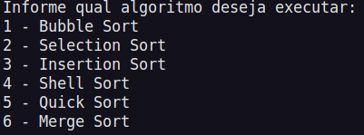
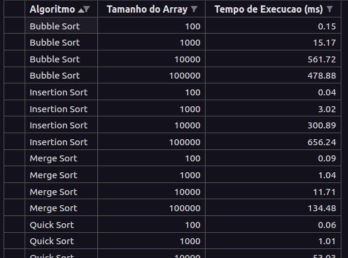
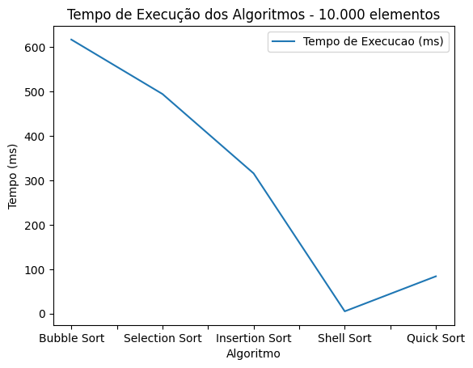

# Estrutura de Dados

Repositório contendo os códigos relacionadas a primeira etapa da disciplina de Estrutura de Dados - 3° período de TSI.

## Algoritmos contidos neste repositório

### Ordenação

  1. Bubble Sort

  2. Selection Sort

  3. Insertion Sort

  4. Shell Sort

  5. Quick Sort

  6. Merge Sort

### Busca

  1. Linear Search
  
  1. Binary Search

## Execução

### Execução manual

Mas caso deseje fazer esse processo manualmente, vá até a pasta onde o arquivo.cpp está localizado digite o código abaixo no terminal para realizar a compilação do código.

```bash
g++ <arquivo.cpp> -o <nome-executavel>
```

E para executar:

```bash
./<nome-executavel>
```

### Execução automatizada

Foi criado para este repositório um shell script para automatizar o processo de execução e compilação de código, execute o seguinte comando:

```bash
./menu
```

Será exibido no terminal um menu, conforme a imagem abaixo:

##### Menu exibido no terminal



Depois apenas insira o número equivalente ao algoritmo que deseja executar.

### Coleta de dados

Neste código foi implementado um mecanismo que por meio da biblioteca ``fstream`` do C++, permite que os tempos de execução retornados, sejam persistidos em um arquivo .csv, este pode ser baixado e utilizado em alguma outra aplicação como o Excel para a análise dos dados.

No entanto, caso o usuário deseje, no arquivo jupyter notebook localizado em uma pasta dentro do diretorio raiz deste projeto, existe um script em python que constrói os graficos com os dados retornados pela aplicação, por meio do arquivo .csv gerado.

## Análise do tempo de execução

Foi criado um script que executa todos os 6 algoritmos de ordenação contidos neste repositório, é possivel executá-lo por meio do seguinte comando:

```bash
./run_all
```

No arquivo main.cpp, cada algoritmo ordena um vetor gerado com 100 (Cem), 1000 (Mil),10000 (Dez mil), e 100000 (Cem mil) elementos.

Dessa forma, para cada ordenação dos algoritmos o tempo em milissegundos retornado a cada execução é armazenado e persistido em um arquivo.csv, aonde detalha-se: o algoritmo utilizado, a quantidade de elementos do vetor ordenado e o tempo necessário para a ordenação.

##### Exemplo de tabela gerada



### Exibição de gráficos

Após isso, o script abre automaticamente o arquivo jupyter com o vsCode, e executa o notebook por meio do nbexec (Que caso a máquina não possua, é instalado automaticamente).

##### Exemplo de gráfico gerado com o jupyter por meio do arquivo.csv


